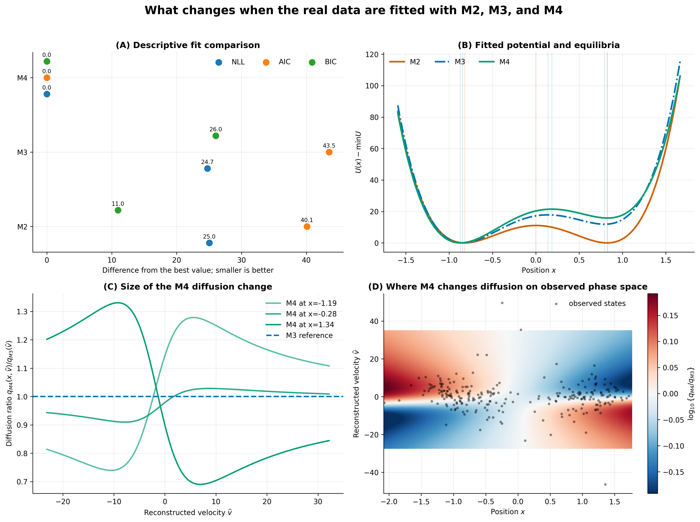

# Position-dependent diffusion in the Greenland Student Kramers model

## M4 implementation, numerical validation, and current evidence

**Zisen Pan**

Research update, June 2026

## Abstract

This report extends the partially observed Student Kramers model used in my
previous Greenland calcium analysis. The new model, denoted M4, allows the
diffusion variance to depend on both position and velocity. The main numerical
problem is that the diffusion must remain nonnegative over the full
two-dimensional state space. Direct constrained optimization was unreliable
when M4 was initialized at the M3 boundary, so I replaced it with a Cholesky
parameterization that keeps every optimization proposal feasible. The current
real-data fit reduces the negative log pseudo-likelihood from 8524.059 for M3
to 8499.312 for M4. A 500-replication parametric bootstrap shows that the
diffusion is well separated from zero on the observed path, although the
global quadratic surface often lies near the positive-semidefinite boundary.
Exact information-omission sensitivity was computed for all 2499 transitions.
A strict 200-replication model-wise IOS bootstrap gives an upper-tail
probability of 0.965 and does not find unusually large leave-one-out
sensitivity under fitted M4. The observed IOS statistic is near the lower edge
of the bootstrap distribution, with lower-tail probability 0.040. These
results support the numerical viability of M4 and describe how it changes the
fitted diffusion, but they do not yet establish that M4 should replace M3. A
new M3-null nested bootstrap using the current Cholesky optimizer is still
required for that comparison.

## 1. Aim of the extension

My previous project fitted three nested Student Kramers models to transformed
Greenland ice-core calcium data. M2 introduced velocity-dependent diffusion,
while M3 also allowed asymmetry in the deterministic force. The main result
was that the large improvement occurred between M1 and M2; M2 and M3 were
nearly indistinguishable in negative log pseudo-likelihood.

The present work starts from a further model proposed by Predrag. M4 keeps the
same drift and partial-observation Strang pseudo-likelihood, but extends the
diffusion variance from

\[
q_{M3}(v)=\alpha v^2+\beta v+\gamma
\]

to

\[
q_{M4}(x,v)=
\alpha v^2+\beta v+\gamma+
\delta x^2+\epsilon xv+\zeta x.
\]

The additional coefficients allow local variability to depend on the climate
coordinate as well as reconstructed velocity. This is a substantive change:
two transitions with the same velocity can have different conditional
variance when they occur in different parts of the position space.

The work had three practical goals:

1. implement M4 without changing the M1-M3 likelihood when the new
   coefficients are zero;
2. obtain a numerically reliable real-data fit under a global positivity
   constraint;
3. repeat the main validation and goodness-of-fit calculations needed before
   interpreting the new model.

## 2. Data and likelihood

The preprocessing follows the final pipeline from the previous project. I use
the 30-80 kyr BP interval after a 17-90 kyr BP prefilter, transform calcium by
negative logarithm, center within the final window, and order the series from
oldest to youngest. The observation spacing is \(h=0.02\) kyr.

Only the position coordinate is observed. I reconstruct velocity by the
forward difference

\[
\widehat V_{t_k}=
\frac{X_{t_{k+1}}-X_{t_k}}{h}.
\]

The final likelihood input contains 2500 pseudo-states
\((X_{t_k},\widehat V_{t_k})\) and 2499 transitions. All four models use the
same corrected partial-observation Strang pseudo-likelihood. M4 changes the
diffusion terms entering the conditional moment calculation, including the
matrix-integral terms used to propagate second moments.

## 3. Model definitions and nesting

All models are represented by the same eleven-dimensional parameter vector:

\[
\theta=
(\eta,a,b,c,d,\alpha,\beta,\gamma,\delta,\epsilon,\zeta).
\]

The common SDE is

\[
dX_t=V_t\,dt,
\]

\[
dV_t=
\left[-\eta V_t+aX_t^3+bX_t^2+cX_t+d\right]dt+
\sqrt{q(X_t,V_t)}\,dW_t.
\]

M1-M3 fix \(\delta=\epsilon=\zeta=0\). M4 estimates all eleven
coefficients. Setting the new coefficients to zero must therefore reproduce
M3 in the displayed formula and at every computational level.

The implementation checks this nesting in four places:

- the diffusion variance;
- simulated paths under a fixed random seed;
- the complete-observation Strang objective;
- every transition contribution in the partial-observation objective.

The tests also compare the `I1-I5` covariance construction with an independent
seven-dimensional moment equation. The current suite contains 44 tests and
passes in full.

## 4. Why the optimizer was changed

### 4.1 The first M4 fit

The first implementation optimized the direct coefficients
\((\delta,\epsilon,\zeta)\). Invalid proposals received a large objective
value. M4 was initialized at the fitted M3 solution, where

\[
\delta=\epsilon=\zeta=0.
\]

This point lies on the boundary of the M4 feasible set. Finite-difference
proposals around the boundary often violate global diffusion positivity and
receive the same large penalty. In the first run, the optimizer returned the
M3 solution and gave the misleading impression that M4 did not improve the
fit.

### 4.2 Interior starts

I next retained the direct parameterization but added nonzero feasible
starting values. Several independent starts found M4 solutions below the M3
objective. This established that the earlier equality between M3 and M4 was
an optimization artifact. The best direct-parameter fit had NLL 8506.650.

This strategy was useful for diagnosis, but it still relied on a discontinuous
penalty to prevent invalid diffusion surfaces. That is undesirable for the
thousands of related optimizations required by exact IOS.

### 4.3 Cholesky parameterization

Write the diffusion variance as

\[
q(x,v)-q_{\mathrm{floor}}
=
\begin{bmatrix}x&v&1\end{bmatrix}
H
\begin{bmatrix}x\\v\\1\end{bmatrix},
\]

where

\[
H=
\begin{bmatrix}
\delta & \epsilon/2 & \zeta/2\\
\epsilon/2 & \alpha & \beta/2\\
\zeta/2 & \beta/2 & \gamma-q_{\mathrm{floor}}
\end{bmatrix}.
\]

Global nonnegativity follows when \(H\) is positive semidefinite. The current
optimizer represents

\[
H=LL^\top
\]

with a lower-triangular matrix \(L\). Every trial point produced by the
optimizer is therefore feasible. I also parameterize

\[
\alpha=2\eta\,\operatorname{logistic}(\rho),
\]

which enforces \(0<\alpha<2\eta\) during optimization.

This change found a lower real-data objective, NLL 8499.312. The difference
from the previous direct-parameter result is large enough to matter for model
comparison, IOS, and bootstrap calibration. Results obtained with the earlier
optimizer are kept as development history but are not treated as formal
evidence for the current M4 fit.

## 5. Real-data fit

The current formal fit is stored under `m4_real_data_cholesky`.

| Model | Free parameters | NLL | AIC | BIC | Minimum \(q\) on observed rectangle |
|---|---:|---:|---:|---:|---:|
| M2 | 6 | 8524.348 | 17060.695 | 17095.637 | 4176.668 |
| M3 | 8 | 8524.059 | 17064.118 | 17110.707 | 4167.946 |
| M4 | 11 | 8499.312 | 17020.623 | 17084.683 | 3867.032 |

M4 improves the NLL by 24.747 relative to M3. Its descriptive likelihood
contrast is

\[
C_{\mathrm{obs}}
=2\{\mathrm{NLL}_{M3}-\mathrm{NLL}_{M4}\}
=49.495.
\]

AIC and BIC also favor M4 in this fit. These criteria describe the fitted
sample, but they are not the final M3 versus M4 test because M3 lies on the
boundary of the M4 parameter space.



**Figure 1.** M2, M3, and M4 fitted to the same partial-observation data.
Panel A reports differences from the best NLL, AIC, and BIC. Panel B compares
the fitted potential. Panels C and D show how M4 changes diffusion relative to
M3 over reconstructed velocity and observed phase space. The largest change
is in the diffusion surface rather than the qualitative double-well structure.

## 6. Diffusion positivity and bootstrap uncertainty

The fitted M4 surface has a global minimum of

\[
\min_{x,v}q_{M4}(x,v)=0.000276.
\]

This value is close to the imposed floor, but the minimizer is far outside the
observed state region. The minimum on the observed rectangle is 3867.032, and
the minimum along the observed pseudo-path is 3869.180. The data do not obtain
their likelihood improvement by approaching zero diffusion.

I ran 500 M4 parametric bootstrap replications. In each replication I
simulated a partial-observation path from fitted M4 and refitted M4 with the
same Cholesky optimizer. There were 496 successful fits.

| Diffusion summary | Observed | Bootstrap 2.5% | Bootstrap median | Bootstrap 97.5% |
|---|---:|---:|---:|---:|
| Global minimum \(q\) | 0.000276 | 0.000272 | 0.000277 | 4801.338 |
| Observed-rectangle minimum \(q\) | 3867.032 | 2190.321 | 3694.253 | 4883.730 |
| Observed-path minimum \(q\) | 3869.180 | 2284.602 | 3718.516 | 4896.911 |
| Observed-path median \(q\) | 4994.935 | 4203.418 | 5050.464 | 6478.521 |

The global-minimum distribution is unusual: many refits lie close to the
semidefinite boundary, while others have a much larger global minimum. The
observed-region and observed-path summaries are more stable and remain far
from zero.


**Figure 2.** M4 parametric-bootstrap results. Panel A shows the refitted NLL
distribution. Panel B separates the global diffusion minimum from minima in
the observed state region. Panel C gives uncertainty in diffusion along the
observed path. Panel D relates the diffusion scale on the observed rectangle
to the median pathwise diffusion.

Individual polynomial coefficients are less stable than the fitted diffusion
surface. In particular, the bootstrap intervals for \(b\), \(d\), and
\(\zeta\) cross zero, and the relative variability of \(\delta\) and
\(\zeta\) is large. I therefore interpret M4 primarily through the fitted
function \(q(x,v)\), not through isolated coefficient signs.

## 7. Exact information-omission sensitivity

For transition \(k\), define

\[
\mathrm{IOS}_k=
\ell_k(\widehat\theta_{-k})-\ell_k(\widehat\theta),
\]

where \(\widehat\theta_{-k}\) is estimated after removing transition \(k\).
The exact statistic is

\[
T_N=\sum_{k=1}^{2499}\mathrm{IOS}_k.
\]

Each model required 2499 leave-one-out refits. Every transition produced a
finite, constraint-valid result.

| Model | Valid transitions | Observed \(T_N\) | Total optimization time |
|---|---:|---:|---:|
| M2 | 2499/2499 | 8.589 | 123.1 s |
| M3 | 2499/2499 | 11.549 | 182.2 s |
| M4 | 2499/2499 | 21.876 | 3793.9 s |

M4 is substantially more expensive because each leave-one-out fit uses the
eleven-parameter Cholesky optimization. Its median leave-one-out iteration
count is 41, compared with 1 for M2 and M3.

The influential transitions are not distributed in the same way across the
models. M2 and M3 concentrate 80% of their positive IOS in 2.4% and 3.4% of
transitions. M4 requires 8.6% of transitions to reach the same share. M4 has a
larger total statistic, but its sensitivity is spread over a broader part of
the path.


**Figure 3.** Observed exact IOS for M2, M3, and M4. Panel A compares each
statistic with its descriptive asymptotic reference and marks the M4 boundary
issue. Panel B locates influential transitions in time. Panel C shows the
concentration of positive IOS. Panel D compares M3 and M4 transition
contributions.

The usual M4 asymptotic reference is not used for a formal decision. The
fitted augmented diffusion matrix has a minimum eigenvalue close to zero, so
the regular interior assumptions behind that reference are doubtful.

## 8. Model-wise finite-sample IOS calibration

I calibrated M4 by a strict model-wise parametric bootstrap. One replication
performs the following calculation:

```text
simulate from fitted M4
    -> refit M4
    -> recompute all 2499 leave-one-out fits
    -> sum the bootstrap IOS contributions
```

All 200 replications completed with 2499 valid transitions. The total summed
replication time was 188.4 CPU hours.

| Quantity | Value |
|---|---:|
| Observed \(T_N\) | 21.876 |
| Bootstrap mean | 50.678 |
| Bootstrap median | 39.829 |
| Bootstrap 95% interval | [21.089, 154.801] |
| Upper-tail probability | 0.965 |
| Lower-tail probability | 0.040 |
| Observed empirical percentile | 3.5% |

The upper-tail result does not reject M4. The observed IOS statistic is not
unusually large relative to paths simulated from fitted M4. This addresses a
goodness-of-fit question: it asks whether the real path is more
leave-one-out-sensitive than M4-generated paths.

The lower-tail result deserves separate attention. The real path is less
sensitive than most simulated paths. This is not evidence of poor fit in the
planned upper-tail test, and it does not prove that M4 is correct. Possible
explanations include differences in extreme-transition frequency, the
partial-observation pseudo-likelihood approximation, or structural features
of the observed path not reproduced by the fitted model.


**Figure 4.** Finite-sample M4 IOS calibration. Panel A places the observed
statistic in the bootstrap distribution. Panel B shows stabilization of upper
and lower tail probabilities. Panel C confirms that IOS is not a simple
replacement for refitted NLL. Panel D reports the cost of each exact-IOS
replication.

The upper-tail estimate is stable between 150 and 200 replications. The
lower-tail estimate is near the 5% threshold. If the lower tail becomes a
formal research question, the bootstrap should be extended to at least 500
replications.

## 9. What the current evidence supports

M4 is implemented consistently with the existing model family. It reduces
exactly to M3 when \(\delta=\epsilon=\zeta=0\), and the likelihood moment
calculations agree with an independent numerical construction.

The Cholesky parameterization addresses the numerical failure that occurred at
the M3 boundary. It keeps the diffusion globally valid during optimization
and finds a lower real-data objective than the earlier penalty-based strategy.

On the observed path, M4 changes the diffusion surface without driving it
close to zero. The parametric bootstrap supports this functional
interpretation, even though some individual coefficients remain weakly
identified. The planned upper-tail IOS test also finds no excessive
leave-one-out sensitivity under fitted M4. The low observed percentile remains
a diagnostic feature rather than a model-selection result.

## 10. What is not yet established

The current results do not prove that M4 is preferable to M3. The NLL, AIC,
and BIC differences are descriptive. A formal finite-sample comparison
requires a new nested bootstrap under fitted M3 in which every M4 alternative
fit uses the current Cholesky optimizer.

An earlier M3-null bootstrap used the direct-parameter M4 optimizer and the
older observed contrast, 34.819. The current observed contrast is 49.495.
Combining the new observed statistic with the old bootstrap distribution
would compare two different estimation procedures and is not valid.

The earlier recovery and M3/M4 discrimination studies also used the previous
optimization strategy. They remain useful development checks, but their M4
results should be repeated before they are used in a final methodological
argument.

## 11. Remaining experiments

The next experiments are ordered by inferential importance.

### 11.1 Current-optimizer M3-null nested bootstrap

Simulate under fitted M3, refit M3 and M4 with the current code, and compare
the observed contrast 49.495 with the finite-sample null distribution. This is
the missing formal test of whether the M4 likelihood gain is unusual under M3.

### 11.2 Repeated recovery under the Cholesky optimizer

Repeat complete- and partial-observation recovery for M4 using the current
optimizer. Report both coefficient recovery and functional recovery of
\(q(x,v)\). The functional summaries are important because the existing
parameter bootstrap shows strong coefficient compensation.

### 11.3 M3/M4 discrimination

Repeat the M3, weak M4, moderate M4, and strong M4 simulation scenarios with
the current optimizer and more than the existing pilot number of paths. These
scenarios should be treated as a sensitivity or power study only after the
effect scales have been calibrated.

### 11.4 Optional extension of IOS calibration

Extend the M4 model-wise IOS bootstrap from 200 to 500 replications only if the
lower-tail behavior is part of the scientific question. The current 200
replications are sufficient for the planned upper-tail conclusion.

## 12. Reproducibility and code organization

The numerical implementation is divided into two packages:

```text
student_kramers/
    model definitions
    Strang likelihoods
    optimization
    simulation
    recovery and discrimination studies
    reusable IOS and bootstrap algorithms

greenland_application/
    Greenland data access
    real-data runners
    application diagnostics
    IOS and bootstrap summaries
    figures
```

The main interactive analysis is
`notebooks/greenland_m4_analysis.ipynb`. Long calculations are executed by
short command modules so they can save transition-level or
replication-level checkpoints.

Every resumable result has a neighboring provenance file containing hashes of
the data, fitted parameters, and implementation. A run cannot resume when the
saved context differs from the current code or settings.

## 13. Current status

The M4 implementation, formal real-data fit, exact observed IOS, 500-run
parameter bootstrap, and 200-run model-wise IOS calibration are complete. The
code passes 44 tests, and the saved formal fit still verifies against its
original provenance after the repository reorganization.

The main unresolved item is the current-optimizer M3 versus M4 nested
bootstrap. Until that calculation is complete, M4 should be described as a
numerically validated and scientifically interesting extension, not as the
formally selected final model.
