## Abstract

This report extends my previous analysis of the Greenland ice-core calcium
series by adding position-dependent diffusion to the partially observed
Student Kramers model. The new model, M4, retains the drift used in M3 but
replaces the velocity-only diffusion variance by a quadratic function of both
position and velocity. The extension caused a numerical problem that was not
present in M1 to M3: the diffusion must remain nonnegative over the full
two-dimensional state space. Direct optimization from the M3 boundary often
returned the M3 solution or moved through invalid diffusion surfaces. I
therefore implemented an augmented quadratic representation and optimized a
Cholesky factor, which keeps every M4 proposal globally feasible.

The current Cholesky fit reduces the negative log pseudo-likelihood from
8524.059 for M3 to 8499.312 for M4. The corresponding AIC and BIC are also
lower. The fitted potential remains close to the M2 and M3 double-well
structure, while the main change occurs in the diffusion surface. Current
predictive simulations show a modest improvement in switching behavior, but
all three fitted models still generate position paths that are too
concentrated and usually switch more often than the observed record.

Three bootstrap questions are kept separate. An earlier 300-replication
M3-null bootstrap used the pre-Cholesky optimizer and is retained only as
development history. A current 500-replication M4 parametric bootstrap gives
496 successful refits and shows substantial compensation among the individual
diffusion coefficients, while the diffusion function over the observed state
region is much more stable. Exact information-omission sensitivity was
computed for all 2499 transitions in M2, M3, and M4. A current
200-replication model-wise M4 IOS bootstrap gives an upper-tail probability of
0.965, so the observed path is not unusually sensitive to deleting one
transition under fitted M4. M4 is therefore numerically viable and changes the
fitted stochastic mechanism in a measurable way. It has not yet been formally
selected over M3 because the M3-null bootstrap must be rerun with the current
optimizer.

## 1. Research question and relation to the previous project

My previous project developed a corrected partial-observation Strang
pseudo-likelihood for the Student Kramers oscillator and applied it to the
Greenland calcium series. The analysis compared three nested models. M1 used
constant diffusion, M2 introduced velocity-dependent diffusion, and M3 also
allowed an asymmetric deterministic force. The main empirical difference was
between M1 and M2. M3 changed the real-data objective only slightly relative
to M2.

The present study asks whether the diffusion should also depend on the
position coordinate. Predrag proposed the model

$$
q_{M4}(x,v)=
\alpha v^2+\beta v+\gamma
+\delta x^2+\epsilon xv+\zeta x.
$$

The three new coefficients allow the random forcing to change across the
climate state space. Two transitions with the same reconstructed velocity can
therefore have different conditional variability when they occur at
different positions.

The project follows the same research sequence as the previous report:

1. verify the mathematical and numerical implementation;
2. study complete and partial estimation on simulated data;
3. fit the competing models to the same Greenland data;
4. compare fitted mechanisms and transition-level likelihood contributions;
5. check simulated densities, switching behavior, and regime durations;
6. quantify parameter and function uncertainty by parametric bootstrap;
7. calculate exact IOS and calibrate it under fitted M4;
8. use a separate M3-null bootstrap for formal M3 versus M4 comparison.

The final step has not yet been rerun with the current optimizer. The report
therefore distinguishes current Cholesky results from earlier development
experiments.

## 2. Greenland calcium data and preprocessing

The data and preprocessing are unchanged from the final version of the
previous project. I use the 30 to 80 kyr BP interval after a 17 to 90 kyr BP
prefilter. Calcium is transformed by negative logarithm, centered inside the
final window, and ordered from oldest to youngest. The fixed observation
spacing is

$$
h=0.02\ \text{kyr},
$$

or 20 years.

Only the position coordinate is observed. The likelihood replaces the latent
velocity by the forward difference

$$
\widehat V_{t_k}=
\frac{X_{t_{k+1}}-X_{t_k}}{h}.
$$

The final input contains 2500 pseudo-states
$(X_{t_k},\widehat V_{t_k})$ and 2499 likelihood transitions. Simulated
paths used for partial-observation studies are processed in the same way: the
internally simulated velocity is discarded and reconstructed from the
simulated position series.

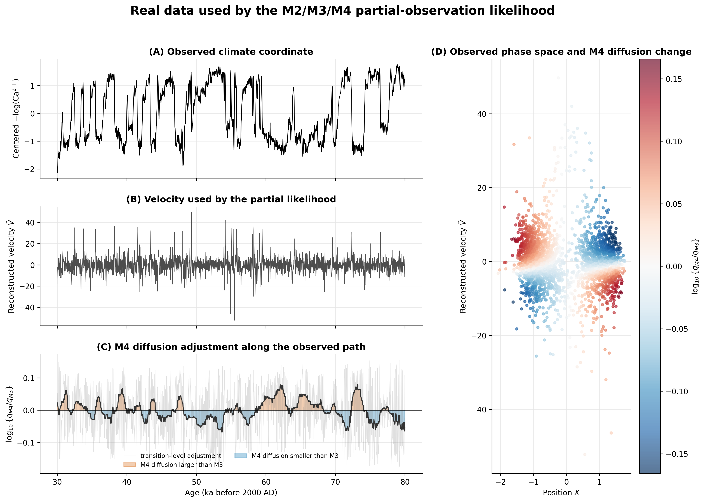

**Figure 1. Greenland data used by the partial-observation likelihood.**
Panel A shows the centered transformed calcium series. Panel B shows the
forward-difference velocity entering the likelihood. Panel C follows the M4
to M3 diffusion ratio through time, while Panel D places the same ratio in
observed phase space. The plot is descriptive: it shows where the fitted M4
diffusion differs from M3, not whether the difference is statistically
significant.

## 3. Model family and partial-observation likelihood

### 3.1 M1 to M4

All models use

$$
dX_t=V_t\,dt
$$

and

$$
dV_t=
\left[
-\eta V_t+aX_t^3+bX_t^2+cX_t+d
\right]dt
+\sqrt{q(X_t,V_t)}\,dW_t.
$$

The common full parameter order is

$$
\theta=
(\eta,a,b,c,d,\alpha,\beta,\gamma,\delta,\epsilon,\zeta).
$$

The model restrictions are:

| Model | Drift restriction | Diffusion variance |
|---|---|---|
| M1 | $b=d=0$ | $q=\gamma$ |
| M2 | $b=d=0$ | $q=\alpha v^2+\beta v+\gamma$ |
| M3 | unrestricted cubic drift | $q=\alpha v^2+\beta v+\gamma$ |
| M4 | same drift as M3 | $q=\alpha v^2+\beta v+\gamma+\delta x^2+\epsilon xv+\zeta x$ |

M4 reduces to M3 when

$$
\delta=\epsilon=\zeta=0.
$$

This nesting is checked in the diffusion function, path simulation under a
fixed random seed, the complete-observation objective, and every
partial-observation transition contribution. The matrix-integral terms
$I_1,\ldots,I_5$ are also compared with an independent seven-dimensional
moment system.

### 3.2 Corrected partial-observation contrast

The likelihood uses the same corrected rough-coordinate Strang construction
as the previous project. The local splitting branch is selected transition by
transition, and the log-variance term uses the fixed partial-observation
correction $2/3$. M4 changes the diffusion-dependent moment matrices but
does not change the observation scheme or the basic contrast.

This distinction matters for comparison. Every real-data model, predictive
simulation, bootstrap refit, and IOS calculation uses the same reconstruction
rule and corrected likelihood. Differences between models therefore come
from their parameter restrictions rather than from different preprocessing.

## 4. M4 positivity and numerical implementation

### 4.1 Why the first optimization failed

The first M4 implementation optimized the direct coefficients
$(\delta,\epsilon,\zeta)$. Invalid proposals received a large objective
value. Starting from fitted M3 sets all three coefficients to zero, which
places the optimizer on the boundary of the M4 parameter space. Numerical
derivatives around this point frequently evaluate invalid diffusion surfaces.
The optimizer can then see a flat wall of penalty values and return the M3
solution even when a better M4 solution exists.

Nonzero feasible starts found lower objectives, showing that the initial
equality between M3 and M4 was an optimization artifact. The best
direct-coefficient fit had NLL 8506.650. This was enough to diagnose the
problem, but a discontinuous feasibility penalty was unsuitable for repeated
recovery, bootstrap, and thousands of leave-one-out fits.

### 4.2 Cholesky parameterization

Write the diffusion above a small numerical floor as

$$
q(x,v)-q_{\mathrm{floor}}=
\begin{bmatrix}
x & v & 1
\end{bmatrix}
H
\begin{bmatrix}
x\\
v\\
1
\end{bmatrix},
$$

where

$$
H=
\begin{bmatrix}
\delta & \epsilon/2 & \zeta/2\\
\epsilon/2 & \alpha & \beta/2\\
\zeta/2 & \beta/2 & \gamma-q_{\mathrm{floor}}
\end{bmatrix}.
$$

Global nonnegativity follows when $H$ is positive semidefinite. The current
optimizer represents

$$
H=LL^\top
$$

with a lower-triangular matrix $L$. Every optimization proposal is then
globally feasible. The tail condition is enforced through

$$
\alpha=
2\eta\,\operatorname{logistic}(\rho),
$$

which keeps $0<\alpha<2\eta$.

### 4.3 Optimization stability

The current audit separates three types of starts. The M3 boundary start
returns NLL 8524.059. Six independent interior starts converge to NLL
8499.360. A warm start from the best M4 solution reaches NLL 8499.312.

The two M4 optima differ by only 0.048 NLL units but have very different
global diffusion minima. The warm-start solution approaches the
positive-semidefinite boundary far outside the data, while the independent
interior solutions have global minima near 3942. This is evidence of weak
identification away from the observed state region. It is not evidence that
the diffusion becomes small where the data are observed.

This result changes how M4 should be interpreted. The reported object is the
fitted diffusion over the observed region and path. Individual coefficients
and remote extrapolation of the quadratic surface are secondary.

## 5. Simulation validation

### 5.1 Intended design

The simulation programme has two levels.

First, same-model recovery asks whether the estimator can recover a known
data-generating model. A latent trajectory $(X,V)$ is simulated from M2,
M3, or M4. The complete estimator uses both coordinates. The partial estimator
keeps only $X$, reconstructs $\widehat V$, and fits the same model.

Second, discrimination asks whether M3 and M4 can be separated under
controlled truth. Partial data are generated under M3 and under weak,
moderate, and strong M4 effects. Both M3 and M4 are fitted to every path, and
the contrast is

$$
C=
2\{\operatorname{NLL}_{M3}-\operatorname{NLL}_{M4}\}.
$$

Positive values favor M4. The M3 scenario measures false-positive behavior,
while the M4 scenarios study sensitivity to the added diffusion terms.

### 5.2 Development recovery study

The saved recovery experiment contains ten trajectories per model, with one
complete and one partial fit for each trajectory. All 60 fits completed. The
median relative RMSE of the fitted diffusion along the latent path was:

| Model | Complete data | Partial data |
|---|---:|---:|
| M2 | 0.078 | 0.177 |
| M3 | 0.090 | 0.167 |
| M4 | 0.107 | 0.185 |

As expected, hiding the velocity makes recovery less precise. M4 is also
slower because it estimates a two-dimensional quadratic diffusion surface.
Its median fitting time increased from about 7 seconds for complete data to
421 seconds for partial data.

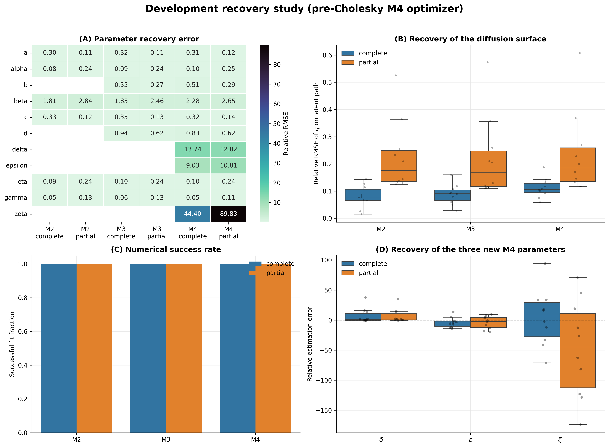

**Figure 2. Complete and partial recovery in the development study.** Panel A
shows relative parameter RMSE. Panel B compares recovery of the diffusion
function along the latent simulated path. Panel C records numerical success,
and Panel D isolates the three new M4 coefficients. The function-level error
is more stable than the coefficient-level error, which indicates
compensation among $\delta,\epsilon,\zeta$ and the older diffusion terms.
These runs used the pre-Cholesky optimizer and must be repeated before they
are treated as formal validation of the current implementation.

### 5.3 Development discrimination study

The discrimination pilot used ten paths in each scenario. M4 obtained a lower
NLL in all ten M3-generated paths as well as all M4-generated paths. The
median contrasts were 4.35 under M3, 6.74 under weak M4, 3.81 under moderate
M4, and 15.71 under strong M4.

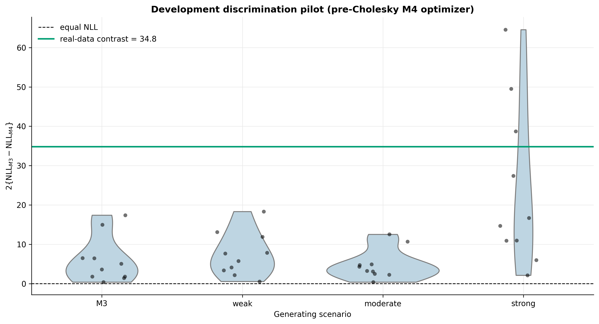

**Figure 3. M3/M4 discrimination pilot.** Each point is one partial-observation
trajectory, and the horizontal line is the old real-data contrast. The strong
M4 scenario tends to produce larger contrasts, but weak and moderate effects
are not ordered and M4 wins every M3-generated path. With ten trajectories
per scenario and no calibrated threshold, this is not a power study. The
result shows why the nested null bootstrap is necessary and why these
scenarios should be rerun with the current optimizer.

### 5.4 What the simulation results currently establish

The development recovery study shows that the complete and partial pipelines
run end to end and that diffusion functions can be recovered more reliably
than individual coefficients. It does not establish current-optimizer
coverage or power.

The required update is therefore specific:

1. rerun repeated M2, M3, and M4 recovery with the Cholesky optimizer used by
   the real-data M4 fit;
2. increase the number of trajectories beyond ten;
3. summarize both parameter recovery and function recovery over the state
   region visited by each path;
4. recalibrate the weak, moderate, and strong M4 effects so that their
   functional separation is interpretable;
5. evaluate discrimination relative to an M3-null bootstrap threshold rather
   than the rule $C>0$.

## 6. Real-data fitting and model comparison

### 6.1 Numerical comparison

The current formal fits are:

| Model | Free parameters | NLL | AIC | BIC |
|---|---:|---:|---:|---:|
| M2 | 6 | 8524.348 | 17060.695 | 17095.637 |
| M3 | 8 | 8524.059 | 17064.118 | 17110.707 |
| M4 | 11 | 8499.312 | 17020.623 | 17084.683 |

M3 improves the NLL by only 0.289 relative to M2. M4 improves it by 24.747
relative to M3. The corresponding likelihood contrast is

$$
C_{\mathrm{obs}}=
2\{8524.058929-8499.311650\}=
49.495.
$$

AIC and BIC also favor M4 in this sample. They remain descriptive because M3
lies on the boundary of M4 and the regular likelihood-ratio reference is not
appropriate.

### 6.2 Potential and diffusion mechanisms

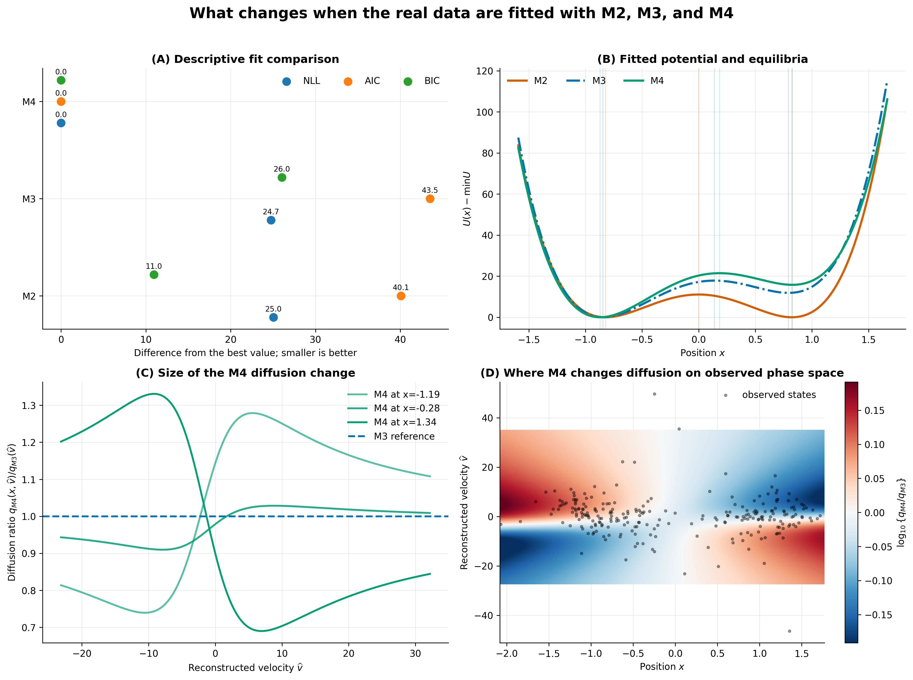

**Figure 4. Real-data comparison of M2, M3, and M4.** Panel A reports NLL,
AIC, and BIC relative to the best model. Panel B compares shifted fitted
potentials and their equilibrium points. The three potentials have the same
qualitative double-well structure, so the main M4 change is not a new
deterministic regime. Panel C compares M4 diffusion with M3 over velocity at
three observed position slices. Panel D maps the diffusion ratio over
observed phase space. M4 increases variability in some regions and decreases
it in others.

The result differs from the earlier M2 to M3 comparison. M3 added asymmetric
drift terms but changed the fitted functions very little. M4 leaves the
potential broadly similar while changing the conditional variance over a
substantial part of the observed state region.

### 6.3 Which transitions produce the improvement

The transition-level decomposition satisfies

$$
\sum_{k=1}^{2499}
\left\{
\ell_{M3,k}-\ell_{M4,k}
\right\}=
24.747.
$$

M4 improves 55.9% of transitions. Positive contributions sum to 109.23 and
negative contributions sum to $-84.48$. The largest positive transition
accounts for 5.4% of the total positive gain, while the largest ten account
for 15.3%. The improvement is therefore not produced by one isolated
transition.

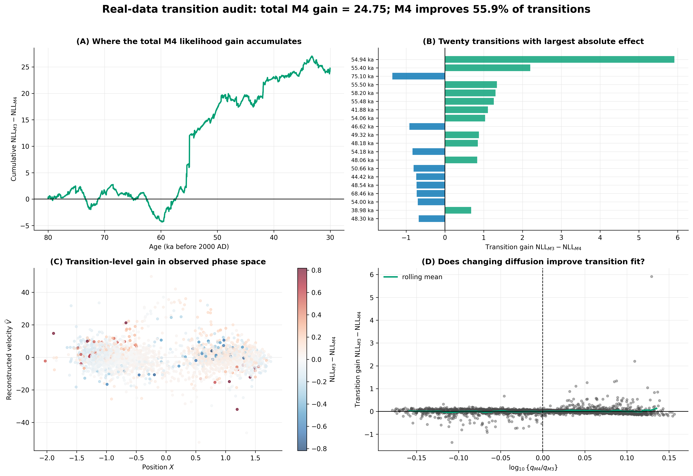

**Figure 5. Transition-level decomposition of the M3 to M4 NLL difference.**
Panel A shows how the cumulative gain develops through time. Panel B lists
the twenty transitions with the largest absolute effects. Panel C locates
gains and losses in phase space. Panel D compares the local likelihood gain
with the fitted diffusion ratio. The gain is spread across the record, but
individual transitions can favor either model.

### 6.4 Global and data-supported positivity

The final M4 quadratic surface has

$$
\min_{x,v}q_{M4}(x,v)=0.000276.
$$

Its minimizer is approximately $(172.9,325.8)$, about 178 standardized
units from the center of the observed states. By contrast,

$$
\min_{\text{observed rectangle}}q_{M4}=3867.0
$$

and

$$
\min_{\text{observed path}}q_{M4}=3869.2.
$$

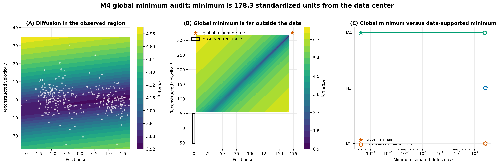

**Figure 6. Global positivity and the observed state region.** Panel A shows
the fitted M4 diffusion where the data occur. Panel B expands the domain to
include the remote global minimizer. Panel C compares global and pathwise
minima across models on a logarithmic scale. The small global M4 minimum
describes extrapolation far outside the data, not a near-degenerate variance
on observed transitions.

## 7. Predictive and regime diagnostics

### 7.1 Design

I generated 100 current-fit trajectories from each of M2, M3, and M4. Each
simulation used the same path length and observation spacing as the real
series. The latent velocity was discarded and reconstructed from simulated
position before diagnostics were calculated.

These checks are not another likelihood comparison. They ask whether the
fitted SDEs reproduce visible features of the observed path, including
marginal spread, occupancy, switching count, and regime duration.

### 7.2 Marginal densities

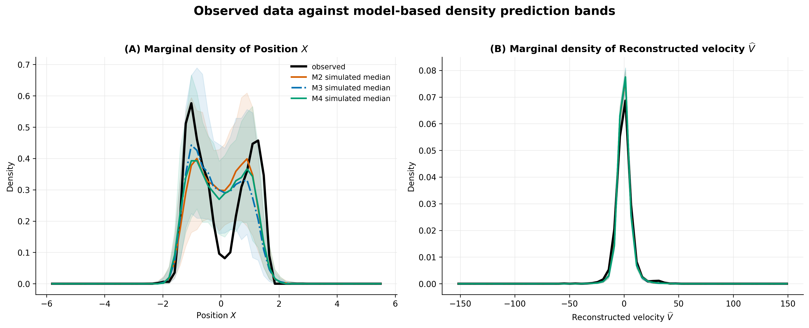

**Figure 7. Observed marginal densities against fitted-model simulations.**
The black curve is the observed density. Colored curves are simulation
medians, and shaded regions are pointwise 95% simulation bands from 100
paths. All three models underestimate the spread of $X$: the observed
standard deviation is above every simulated value. Reconstructed velocity is
closer to the simulated distributions, with the observed standard deviation
at the 90th percentile under M4, compared with the 95th and 97th percentiles
under M2 and M3.

M4 improves some aspects of the velocity distribution but does not reproduce
the sharp empirical separation and overall spread of the position
distribution. This is a limitation shared with the previous model family.

### 7.3 Predictive-check map

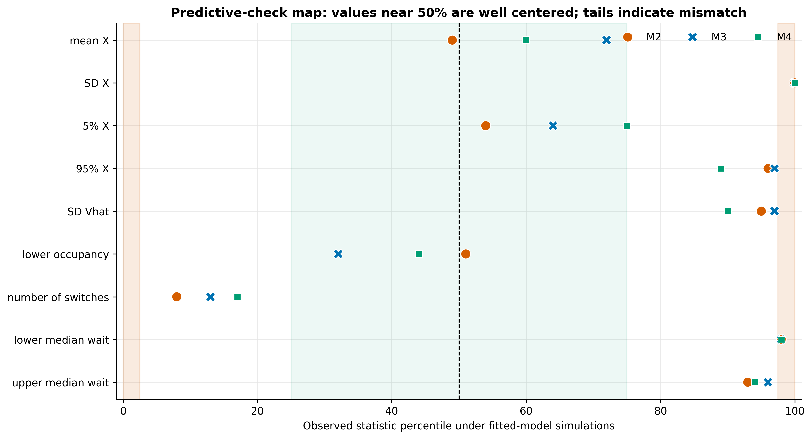

**Figure 8. Percentile of each observed diagnostic under fitted-model
simulations.** Values near 50% are well centered. Values near 0% or 100%
indicate a mismatch. Lower-state occupancy is reasonably centered for all
three models. Position spread is at the 100th percentile for every model.
M4 produces a slightly lower median switching count than M2 and M3, but the
observed count remains in the lower part of its simulation distribution.

### 7.4 Waiting times and transition behavior

The observed path contains 45 regime switches. Median simulated switch counts
are 63.5 for M2, 63.5 for M3, and 61 for M4. The observed median lower-regime
duration is 800 years, compared with simulated medians of 185, 180, and 200
years. The observed upper-regime median is 520 years, compared with 205, 180,
and 240 years.

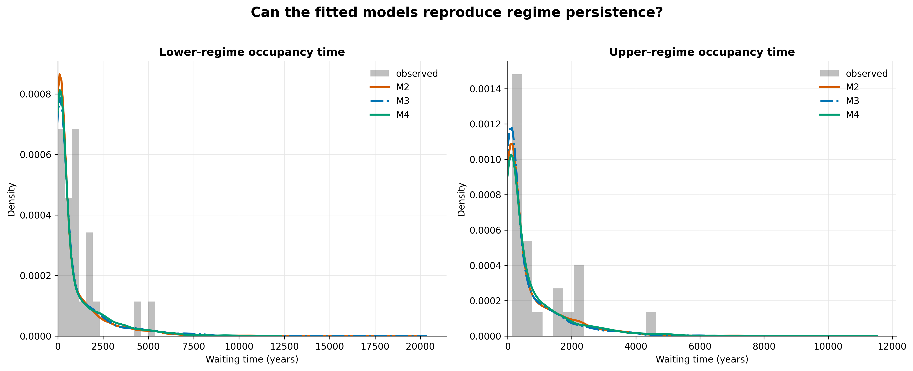

**Figure 9. Observed and simulated regime durations.** The histogram gives
observed occupancy times, while the curves pool simulated occupancy times
from 100 paths per model. M4 moves the upper-regime duration somewhat toward
the observed scale and reduces the typical number of switches, but all
models still spend too little time in persistent regimes. The fitted local
transition law therefore improves before the long-run regime behavior is
fully reproduced.

## 8. Three bootstrap designs

The word "bootstrap" refers to three different calculations in this project.
They must not be interpreted as interchangeable.

| Design | Generating model | Refit in each replication | Question |
|---|---|---|---|
| M3-null nested bootstrap | fitted M3 | M3 and M4 | Is the observed M4 likelihood gain unusual under M3? |
| M4 parametric bootstrap | fitted M4 | M4 | How uncertain are M4 parameters and fitted functions? |
| M4 model-wise IOS bootstrap | fitted M4 | M4 plus 2499 leave-one-out fits | Is observed IOS unusually large under M4? |

The current M4 parametric and model-wise IOS bootstraps use the Cholesky
optimizer. The saved M3-null nested bootstrap does not.

### 8.1 Historical M3-null bootstrap

The earlier nested bootstrap generated 300 trajectories under fitted M3 and
refitted M3 and M4 to each partial-observation path. It used the old observed
contrast 34.819 and the direct-coefficient M4 optimizer. All 300 replications
completed. The null median was 10.405, its 95th percentile was 51.612, and the
finite-sample upper-tail probability was 0.110.

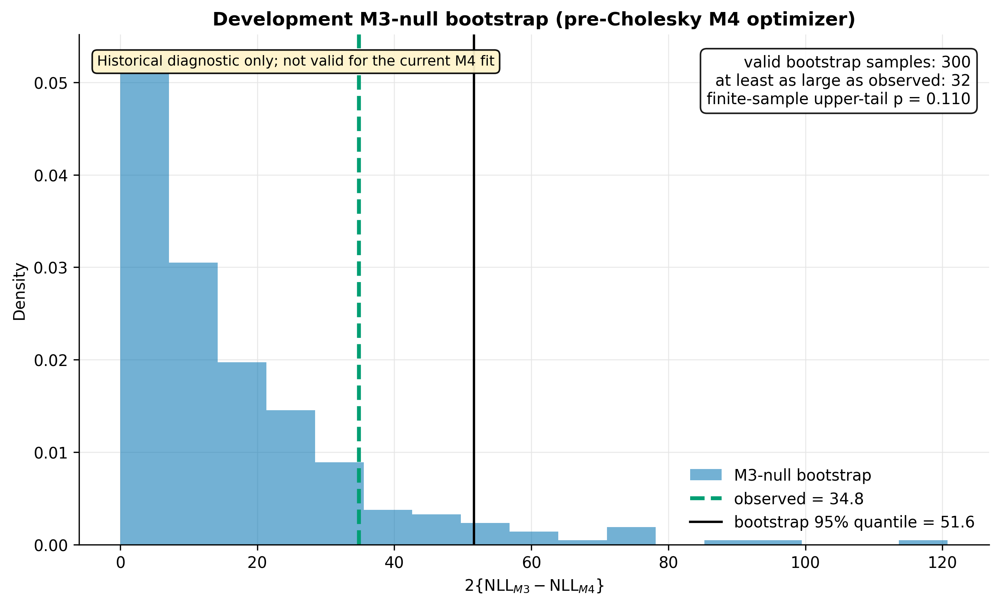

**Figure 10. Development M3-null bootstrap.** The histogram is the old
finite-sample null distribution and the vertical line is the old observed
contrast. This result was useful during development because it showed that
positive M3 to M4 improvements can occur under M3. It is not valid for the
current real-data contrast 49.495 because both the observed M4 estimator and
the bootstrap M4 estimator have changed.

The correct next calculation is to generate from the current fitted M3 and
refit M4 with the current Cholesky optimizer in every replication. The old
null distribution will not be reused.

## 9. M4 parametric bootstrap

### 9.1 Design and convergence

The current parametric bootstrap contains 500 replications. Each replication:

1. simulates a trajectory from the current fitted M4;
2. discards the latent velocity;
3. reconstructs velocity from the simulated position path;
4. refits M4 with the Cholesky optimizer;
5. records parameters, NLL, diffusion minima, and pathwise diffusion.

There were 496 successful refits and four failures, giving a success rate of
99.2%.

### 9.2 Parameter uncertainty

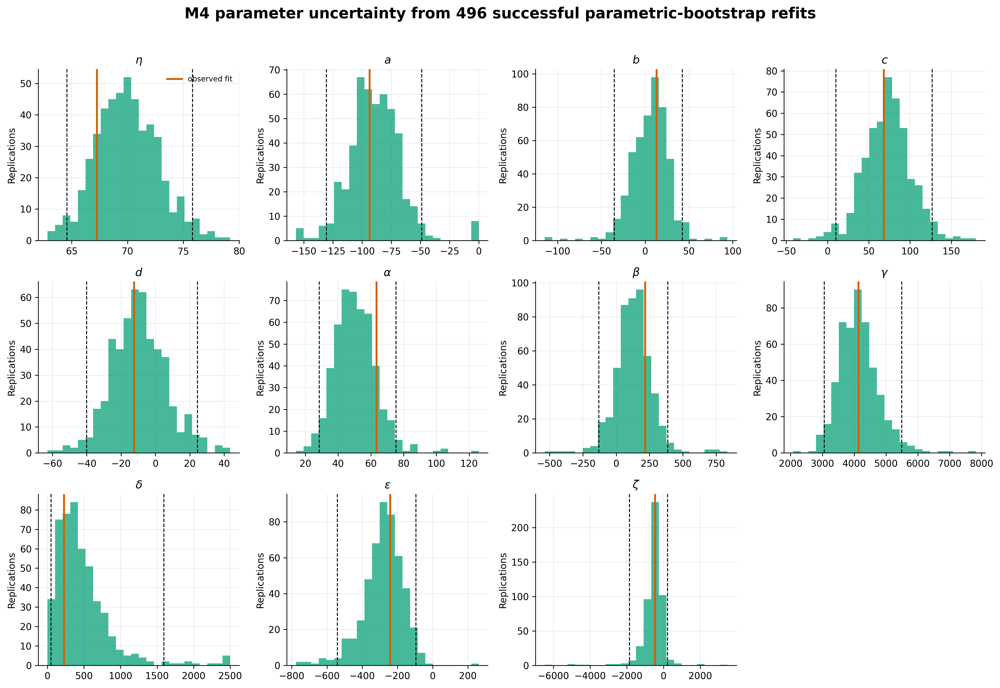

**Figure 11. Empirical distributions of all eleven M4 coefficients.** The
orange line is the real-data estimate and dashed lines are empirical 2.5% and
97.5% quantiles. The drift coefficient $a$, friction $\eta$, and
diffusion intercept $\gamma$ are comparatively stable. Intervals for
$b$, $d$, and $\zeta$ cross zero. The new coefficients $\delta$ and
$\zeta$ have large relative variability, while the interval for
$\epsilon$ remains negative in this bootstrap run.

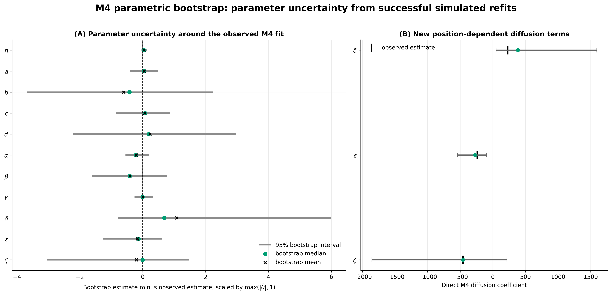

**Figure 12. Parameter uncertainty relative to the observed fit.** Panel A
puts parameters with different units on a common relative scale. Panel B
shows the direct intervals for $\delta,\epsilon,\zeta$. The wide,
correlated coefficient uncertainty is consistent with several quadratic
surfaces producing similar diffusion over the observed region.

### 9.3 Potential and diffusion interpretation

The fitted M4 potential has wells near $-0.871$ and $0.826$, separated by
a barrier near $0.185$. Among bootstrap refits with three valid stationary
points, the 95% intervals are approximately:

| Quantity | Observed | Bootstrap 95% interval |
|---|---:|---:|
| lower well | -0.871 | [-1.104, -0.714] |
| barrier | 0.185 | [-0.336, 0.479] |
| upper well | 0.826 | [0.589, 1.081] |
| lower barrier height | 21.46 | [2.59, 56.95] |
| upper barrier height | 5.66 | [0.21, 42.42] |

Only 417 of the 496 successful refits retain the same three-stationary-point
double-well configuration. The potential interpretation is therefore less
stable than the real-data point estimate alone suggests.

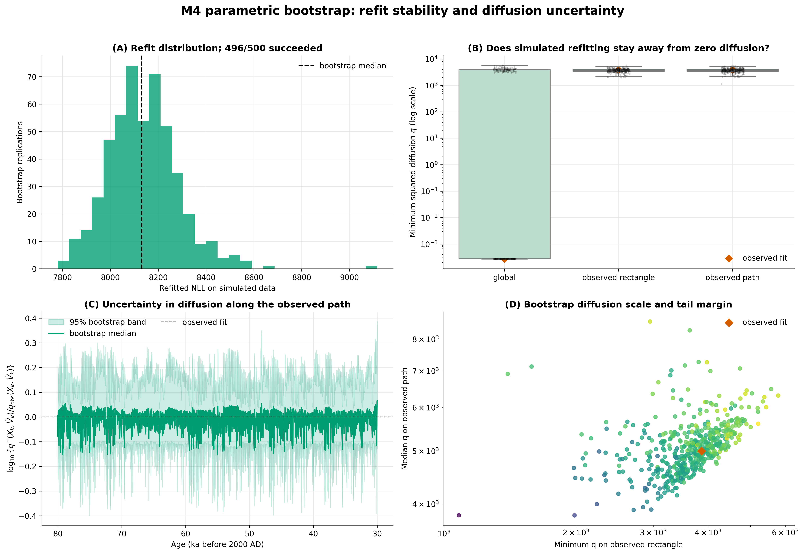

**Figure 13. Refitting stability and uncertainty of the diffusion function.**
Panel A shows the bootstrap NLL distribution. Panel B distinguishes the
global minimum from minima on the observed rectangle and path. Panel C gives
pointwise uncertainty in diffusion along the real path. Panel D compares
the observed-region diffusion scale with the tail margin. The global minimum
is often near the semidefinite boundary, but the observed-region and
pathwise minima remain far from zero.

The parameter bootstrap supports a function-level interpretation rather than
a coefficient-by-coefficient one. The data constrain the diffusion where
states are observed. They provide much weaker information about the remote
global minimizer of the quadratic surface.

## 10. Exact information-omission sensitivity

### 10.1 Statistic

For transition $k$, let $\widehat\theta_{-k}$ be the estimate obtained
after removing that transition. The information-omission contribution is

$$
\operatorname{IOS}_k=
\ell_k(\widehat\theta_{-k})
-\ell_k(\widehat\theta).
$$

The exact statistic is

$$
T_N=
\sum_{k=1}^{2499}\operatorname{IOS}_k.
$$

A large contribution means that the full-data fit predicts transition $k$
better than the model fitted without it. Large $T_N$ indicates excessive
leave-one-out sensitivity.

### 10.2 Observed exact IOS

Every transition produced a finite, constraint-valid result:

| Model | Valid transitions | $T_N$ | Total optimization time |
|---|---:|---:|---:|
| M2 | 2499/2499 | 8.589 | 123 s |
| M3 | 2499/2499 | 11.549 | 182 s |
| M4 | 2499/2499 | 21.876 | 3794 s |

M4 is slower because each leave-one-out fit performs an eleven-parameter
Cholesky optimization. Its median iteration count is 41, compared with one
for M2 and M3.

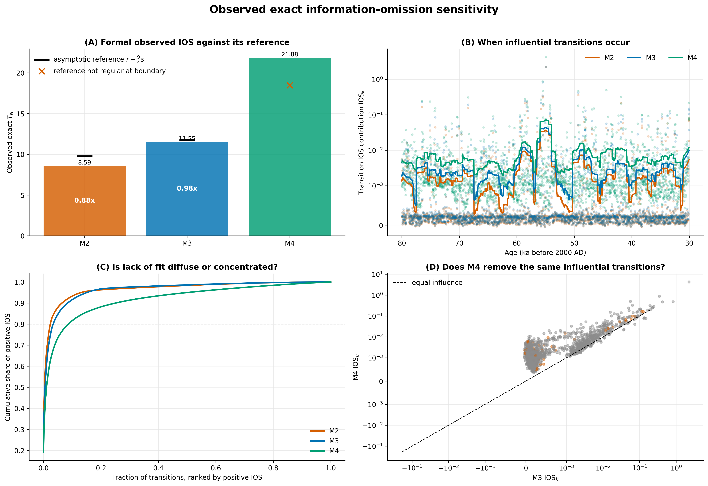

**Figure 14. Exact IOS comparison.** Panel A compares the three observed
statistics and marks whether their regular asymptotic reference is
applicable. Panel B shows when influential transitions occur. Panel C shows
how concentrated the positive IOS mass is, and Panel D compares transition
contributions for M3 and M4. M4 has a larger total statistic, but its positive
sensitivity is spread over more transitions.

M2 and M3 require 2.4% and 3.4% of transitions to accumulate 80% of positive
IOS. M4 requires 8.6%. The largest M4 IOS contribution is 4.214. M4 is
therefore not simply dominated by one transition.

### 10.3 Location of influential transitions

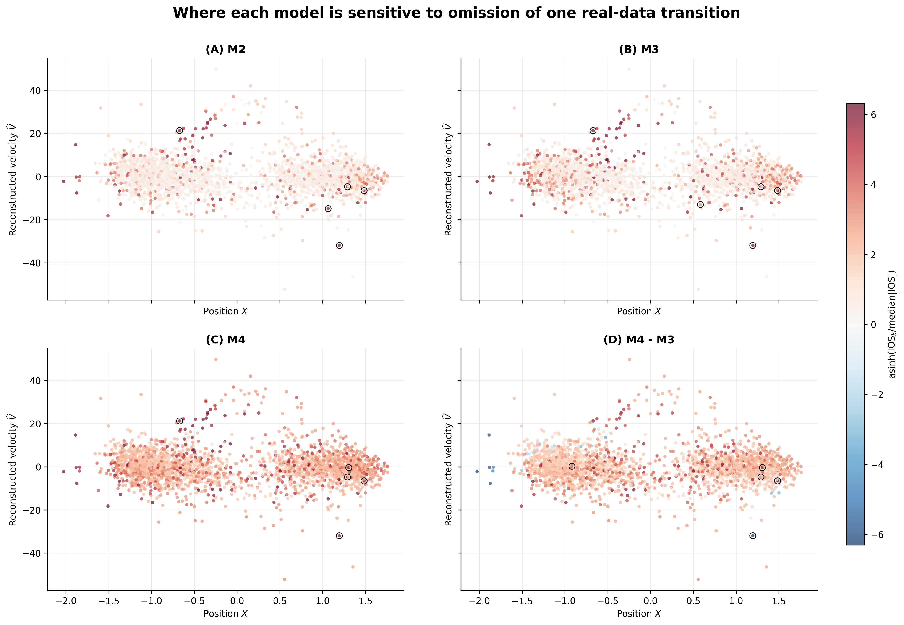

**Figure 15. Location of influential transitions.** The figure maps
model-specific IOS contributions through time and over the observed
$(X,\widehat V)$ states. The final panel shows where M4 sensitivity exceeds
M3 sensitivity. Influential transitions occur in several parts of phase space
rather than only at regime crossings.

The top-20 overlap is 17 transitions for M2 versus M3, 14 for M2 versus M4,
and 16 for M3 versus M4. The models often identify the same difficult
transitions, but their rankings differ.

### 10.4 Numerical diagnostics

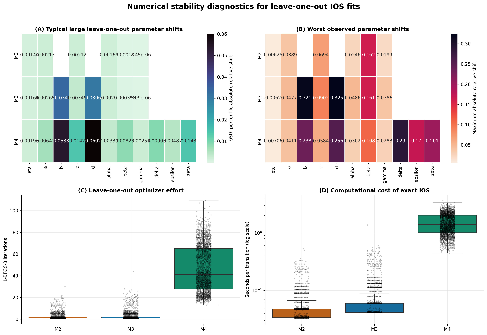

**Figure 16. Numerical behavior of the leave-one-out fits.** The panels
summarize parameter movement, optimizer effort, held-out contributions, and
runtime. This figure separates a scientifically influential transition from
a numerically difficult refit. The complete validation table confirms 2499
valid rows for every model.

The regular M4 asymptotic reference is not used for a formal decision. The
minimum eigenvalue of its fitted augmented diffusion matrix is close to zero,
so an interior asymptotic approximation is doubtful. M4 is calibrated by
simulation instead.

## 11. Model-wise M4 IOS bootstrap

### 11.1 Design

One model-wise IOS replication performs:

```text
simulate from fitted M4
    -> reconstruct velocity
    -> refit M4
    -> run all 2499 leave-one-out fits
    -> sum the bootstrap IOS contributions
```

All 200 replications completed with 2499 valid transitions. The total summed
replication time was about 188 CPU hours.

### 11.2 Calibration result

| Quantity | Value |
|---|---:|
| observed $T_N$ | 21.876 |
| bootstrap mean | 50.678 |
| bootstrap median | 39.829 |
| bootstrap 95% interval | [21.089, 154.801] |
| upper-tail probability | 0.965 |
| lower-tail probability | 0.040 |
| observed empirical percentile | 3.5% |

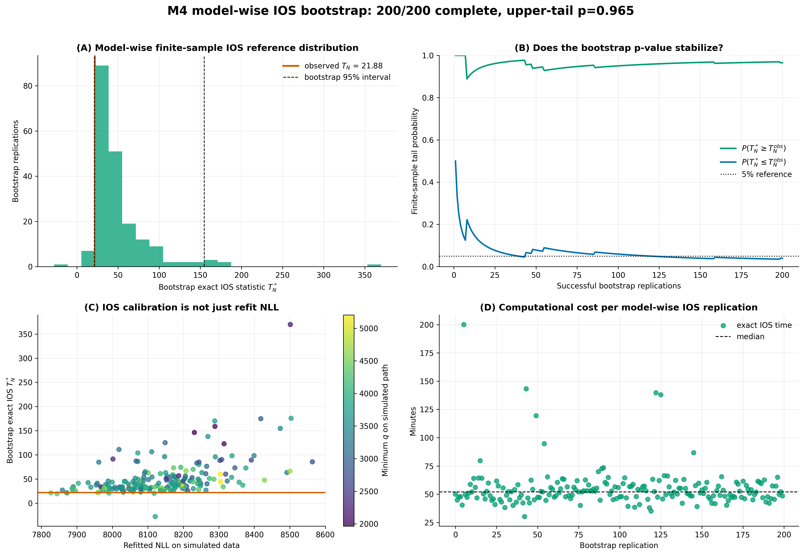

**Figure 17. Finite-sample IOS calibration under fitted M4.** Panel A places
the observed statistic in the bootstrap distribution. Panel B shows
stabilization of the upper and lower tail probabilities as replications
accumulate. Panel C compares refitted NLL with exact IOS and confirms that the
two quantities answer different questions. Panel D records the computational
cost of a full exact-IOS replication.

The planned IOS alternative is excessive instability, so the formal direction
is the upper tail. The value 0.965 does not reject M4. The observed path is not
more leave-one-out-sensitive than paths generated under fitted M4.

The lower-tail probability of 0.040 is a separate calibration warning. The
real path is less sensitive than most simulated paths. This does not prove
good fit, and it is consistent with the predictive results showing that
simulated paths often switch more frequently than the real record.

## 12. Comparative assessment

The current evidence answers several different questions.

| Question | Current result | Limitation |
|---|---|---|
| Does M4 reduce the real-data objective? | Yes. NLL improves by 24.747 over M3. | Additional flexibility always helps in sample. |
| Does M4 preserve global diffusion validity? | Yes, by construction under the Cholesky parameterization. | The global surface is weakly identified far from the data. |
| Is the improvement caused by one transition? | No. The gain is spread through the record. | Some individual transitions still favor M3. |
| Are M4 coefficients precisely estimated? | No. Several intervals are wide and cross zero. | Function-level diffusion is more stable than coefficients. |
| Does M4 reproduce observed densities and persistence? | Partly. Velocity and switching improve modestly. | Position spread and long waiting times remain poorly reproduced. |
| Is observed IOS unusually large under M4? | No. Upper-tail probability is 0.965. | The observed statistic is unusually low in the opposite tail. |
| Is M4 formally selected over M3? | Not yet. | Current-optimizer M3-null bootstrap is missing. |

The strongest current conclusion is that M4 changes the fitted stochastic
mechanism without destabilizing the likelihood on the observed path. The
extra position dependence is not absorbed back into M3, and the NLL
improvement is distributed across transitions. At the same time, the
bootstrap shows that direct coefficients and remote extrapolation of the
quadratic surface are weakly identified.

M4 also does not solve every model-check problem. The observed position series
is more dispersed and more persistent than typical simulations from all
three fitted models. This suggests that the next model revision, if needed,
should be motivated by long-run state occupancy or additional structure in
the drift, rather than by local likelihood alone.

## 13. Required next experiments

The report is ready as a research update, but three calculations remain before
a final model-selection conclusion.

1. **Current M3-null nested bootstrap.** Simulate under the current fitted M3
   and refit M3 and Cholesky M4 in every replication. Compare the resulting
   null distribution with $C_{\mathrm{obs}}=49.495$.
2. **Current repeated recovery.** Rerun complete and partial M2, M3, and M4
   recovery with more than ten paths and summarize function recovery over the
   visited state region.
3. **Current discrimination study.** Recalibrate weak, moderate, and strong M4
   effects, increase replication counts, and evaluate detection against the
   nested-bootstrap threshold.

The M4 model-wise IOS bootstrap can remain at 200 replications for the planned
upper-tail conclusion. Extending it to 500 would mainly refine the lower-tail
probability.

## 14. Reproducibility and repository structure

The repository separates reusable mathematics from the Greenland
application:

```text
student_kramers/
    model definitions
    Strang likelihoods
    estimation and simulation
    recovery, discrimination, IOS, and bootstrap algorithms

greenland_application/
    Greenland data loading
    real-data and diagnostic runners
    result summaries
    publication figures and report assets
```

The interactive workflow is
`notebooks/greenland_m4_analysis.ipynb`. It calls Python modules and reads
saved tables; long calculations are not hidden inside notebook cells.

The Git-trackable evidence snapshot is stored in:

```text
docs/results/current/
docs/results/development/
```

The first directory contains current Cholesky evidence. The second contains
pre-Cholesky development experiments. Their status and local source are listed
in `docs/results/manifest.csv`.

The report and figures can be rebuilt with:

```bash
python3 -m greenland_application.run_report_assets --refresh-snapshot
quarto render docs/M4_GREENLAND_RESEARCH_REPORT.md --to html
quarto render docs/M4_GREENLAND_RESEARCH_REPORT.md --to pdf
```

The full numerical test suite is run with:

```bash
python3 -m unittest discover tests -v
```

## 15. Conclusion

The M4 extension is now implemented in a way that respects global diffusion
positivity throughout optimization. This resolved the boundary-start failure
of the direct-coefficient implementation and produced a lower real-data
objective than M3. M4 retains the broad double-well potential of M2 and M3,
but changes conditional variability across observed position and velocity.

The current parameter bootstrap, transition decomposition, predictive checks,
and exact IOS calculations give a mixed but interpretable result. The
diffusion function is stable over the data-supported region even though its
individual coefficients and remote global minimum are not. M4 improves local
fit and modestly improves switching behavior, but it still understates
position spread and regime persistence. Its observed IOS is not unusually
large under a strict model-wise bootstrap.

The remaining inferential question is narrower than the initial
implementation problem. M4 is numerically valid and scientifically
interesting. Whether its real-data likelihood improvement is stronger than
the improvement expected from extra flexibility under M3 will be answered by
the current-optimizer M3-null bootstrap.
