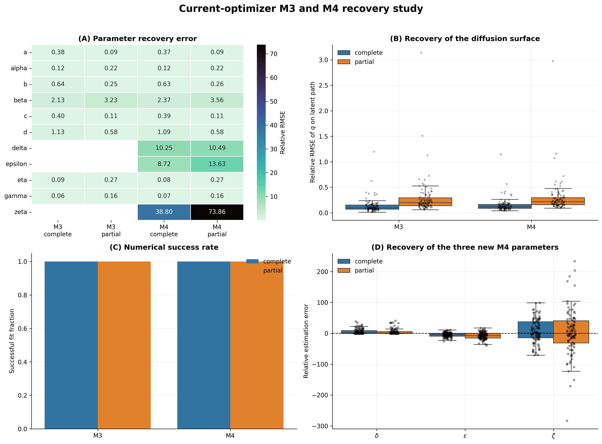
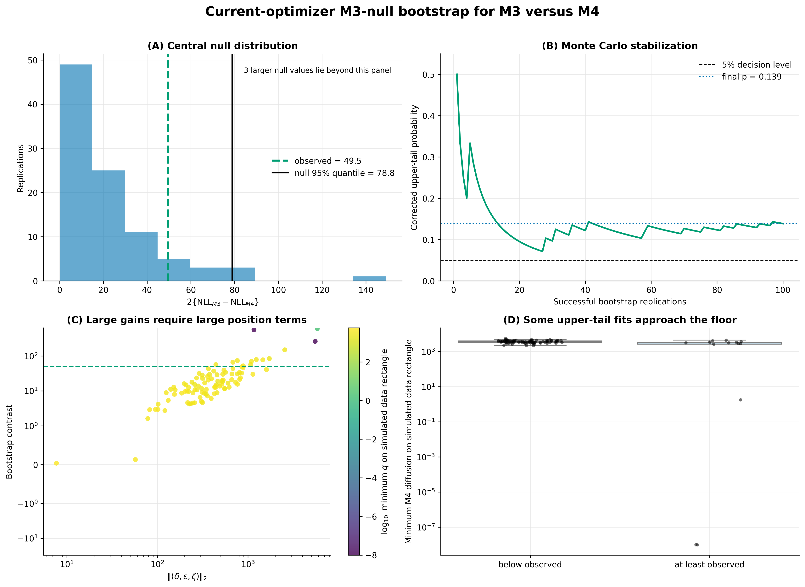

## Executive summary

- M4 keeps the M3 drift and observation scheme, but extends the diffusion
  variance from $q(v)$ to $q(x,v)$ by adding three position-dependent terms.
- The current implementation optimizes a Cholesky factor of the augmented
  diffusion matrix. Every trial diffusion is therefore globally feasible.
- On the Greenland data, M4 reduces NLL from 8524.059 to 8499.312, giving the
  observed contrast $C_{\mathrm{obs}}=49.495$.
- A current-optimizer M3-null bootstrap completed 100/100 valid replications.
  Its corrected upper-tail probability is 0.1386, so the likelihood gain does
  not select M4 over M3 at the 5% level.
- Current recovery experiments show that the fitted diffusion function is
  more stable than the three new coefficients. Predictive checks still show
  excessive switching and insufficient long-run position spread.
- No further large bootstrap is required for the present decision. The main
  open issues concern the intended M4 parameter space, numerical bounds, and
  whether the next model change should target diffusion or persistence.

## Questions for discussion

1. **Parameter space.** Should M4 require
   $q(x,v)\geq q_{\mathrm{floor}}$ globally, as in the current positive
   semidefinite construction, or only over a scientifically meaningful state
   region?
2. **Final estimator.** Is the current Cholesky parameterization with
   multistart L-BFGS-B an acceptable final estimator, or should it be compared
   with another constrained optimizer or parameterization?
3. **Restrictions and search bounds.** Which restrictions should be treated as
   part of the statistical model, and which are only numerical safeguards?
   In particular, should the strict tail condition $0<\alpha<2\eta$, the
   diffusion floor, and the current Cholesky search bounds be retained?
4. **Near-boundary fits.** Two M3-null replications reached the current
   $l_{11}$ search bound and several upper-tail fits approached the diffusion
   floor. Should these motivate wider bounds, regularization, or a different
   definition of the M4 alternative?
5. **Scientific direction.** Given that M4 improves descriptive likelihood
   but is not selected by the finite-sample comparison, should it remain a
   mechanism-level extension, or should the next model revision target the
   remaining persistence and switching discrepancies through the drift or
   latent-state structure?

## Model and implementation

M3 uses velocity-dependent diffusion, whereas M4 adds position dependence:

$$
\begin{aligned}
q_{M3}(v)
&=\alpha v^2+\beta v+\gamma,\\
q_{M4}(x,v)
&=\alpha v^2+\beta v+\gamma
  +\delta x^2+\epsilon xv+\zeta x.
\end{aligned}
$$

Thus M4 reduces to M3 when
$\delta=\epsilon=\zeta=0$. Write

$$
q_{M4}(x,v)-q_{\mathrm{floor}}=
\begin{pmatrix}x&v&1\end{pmatrix}
H
\begin{pmatrix}x\\v\\1\end{pmatrix},
\qquad H=LL^\top.
$$

The Cholesky representation keeps every optimizer proposal feasible. The
additional parameterization

$$
\alpha=2\eta\,\mathrm{logistic}(\rho)
$$

enforces the Student Kramers tail condition throughout optimization.

## Current evidence and limits

| Claim or analysis | Current evidence | Conclusion |
|---|---|---|
| M4 is numerically feasible | Cholesky optimizer, nesting checks, 44 tests | Supported |
| M4 improves the real-data objective | M3 NLL 8524.059; M4 NLL 8499.312 | Supported descriptively |
| M4 is selected over M3 | M3-null bootstrap: $p=0.1386$ | Not supported at 5% |
| The diffusion function can be recovered | 100 M3 and 100 M4 recovery paths | Supported at function level |
| The three new coefficients are precisely identified | Recovery and parametric bootstrap intervals are broad | Not supported |
| M4 resolves the predictive discrepancies | Switching remains too frequent and position spread too small | Not supported |
| Observed IOS is unusually large under fitted M4 | Model-wise IOS upper-tail probability 0.965 | No |
| Pre-Cholesky M4 analyses support the current result | Stored only as development history | No |

The current and historical result tables are kept separately under
[`docs/results/current`](results/current/) and
[`docs/results/development`](results/development/).

## Main empirical findings

### Real-data mechanism

**Figure 1. Real-data mechanism comparison.** M4 has the lowest descriptive
NLL, while the fitted potential remains broadly similar to M3. The substantive
change is the position-velocity diffusion surface, not the drift.

The fitted M4 global minimum lies close to the numerical floor, but the
minimizer is remote from the observed state region. Diffusion remains large on
the observed rectangle and path.

**Figure 2. Global versus data-supported positivity.** The current fit is near
the PSD boundary only in a remote extrapolation region. This distinction is
why the intended domain of the positivity constraint requires a modelling
decision rather than a purely numerical answer.

### Recovery and predictive behavior

All complete and partial fits succeeded in 100 M3 and 100 M4 recovery paths.
Median relative RMSE of the fitted diffusion function was 0.119 for complete
M4 data and 0.216 after velocity was discarded and reconstructed.

**Figure 3. Current-optimizer recovery.** The diffusion function is recovered
more reliably than $\delta$, $\epsilon$, and $\zeta$ separately. Interpretation
should therefore focus on $q(x,v)$ over relevant states rather than on isolated
coefficient signs.

The predictive check used 100 simulated paths from each fitted model. M4 moves
some switching and regime-duration summaries toward the data, but it does not
reproduce the observed position spread or long persistence.

**Figure 4. Predictive limitations.** M4 improves local likelihood without
solving the principal long-run discrepancies, so a lower NLL alone is not a
sufficient reason to keep adding diffusion flexibility.

## What the three bootstraps answer

| Calculation | Generating and refitting scheme | Question answered |
|---|---|---|
| M4 parametric bootstrap | Simulate from fitted M4, reconstruct velocity, refit Cholesky M4 | Parameter and function uncertainty under fitted M4 |
| Model-wise M4 IOS bootstrap | Simulate from fitted M4, refit M4, recompute exact IOS | Whether observed IOS is unusually large under fitted M4 |
| M3-null nested bootstrap | Simulate from fitted M3, refit M3 and Cholesky M4 | Whether the observed M3-to-M4 likelihood gain is unusual under M3 |

The first two calculations do not compare M3 with M4 and cannot establish
model selection. The third calculation is the relevant finite-sample
comparison.

## Current M3 versus M4 comparison

Each replication simulated from the current fitted M3, discarded latent
velocity, reconstructed it by finite differences, refitted M3 with 8 starts,
and refitted Cholesky M4 with 12 starts.

| Quantity | Result |
|---|---:|
| Successful replications | 100/100 |
| Observed contrast | 49.495 |
| Null median | 15.315 |
| Null 95% quantile | 78.848 |
| Exceedances | 13/100 |
| Corrected upper-tail probability | 0.1386 |
| Monte Carlo standard error | 0.0344 |
| Exceedance probability 95% interval | [0.071, 0.212] |

**Figure 5. Finite-sample M3 versus M4 comparison.** The observed contrast lies
below the null 95% quantile and the corrected tail probability stabilizes
above 0.05. Large null gains are associated with large position terms and,
in a few cases, diffusion surfaces close to the floor.

The 95% interval for the exceedance probability excludes 0.05, so extending
this run to 300 replications is not needed for the current decision. The
near-boundary tail behavior should instead be studied as a property of the
alternative estimator.

## Proposed next steps

1. Agree on whether global PSD positivity is the intended scientific M4
   parameter space.
2. Run a pre-specified sensitivity analysis for the Cholesky bounds and
   near-floor null fits; do not remove extreme replications after inspection.
3. Redesign discrimination scenarios using a stated functional separation in
   $q(x,v)$ over a relevant phase-space distribution.
4. Decide whether the remaining persistence mismatch motivates a change in
   the drift or latent-state structure rather than another diffusion term.

No additional expensive bootstrap is currently required.

## Supporting material

- [Implementation note](M4_IMPLEMENTATION_NOTE_FOR_SUPERVISOR.md): model
  equations, Cholesky coordinates, likelihood integration, and validation.
- [Full research report](M4_GREENLAND_RESEARCH_REPORT.md): complete technical
  record, figures, uncertainty analyses, predictive checks, and IOS.
- [Rendered full report](M4_GREENLAND_RESEARCH_REPORT.pdf): fixed-layout PDF.
- [Code reference](CODE_REFERENCE.md): function-level lookup.
- [Result snapshot](results/README.md): current versus development evidence and
  provenance.
